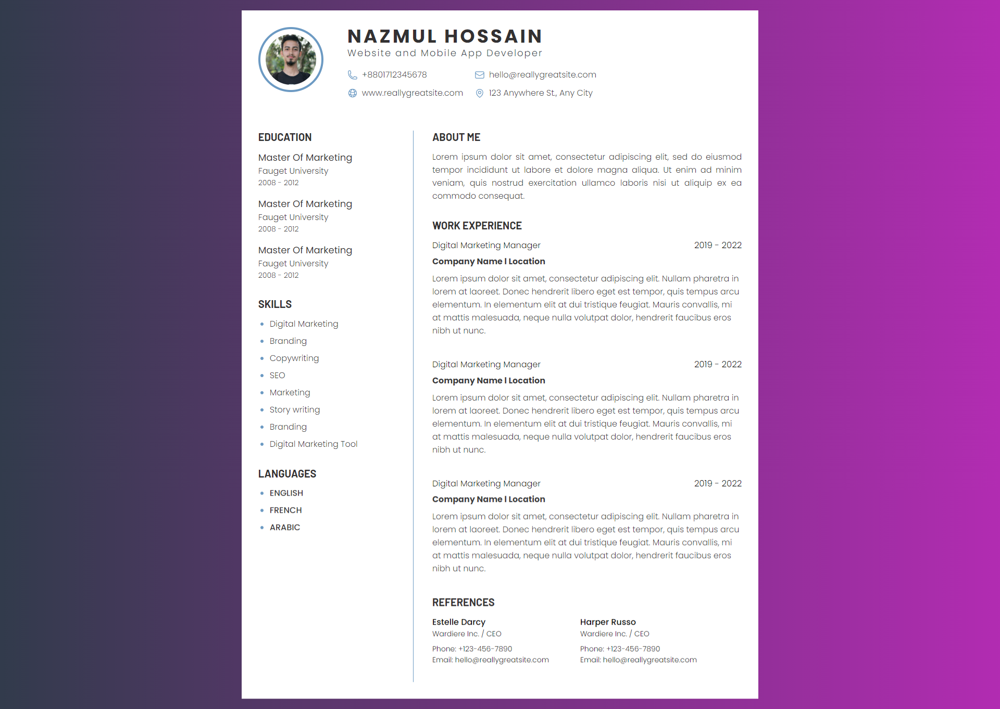
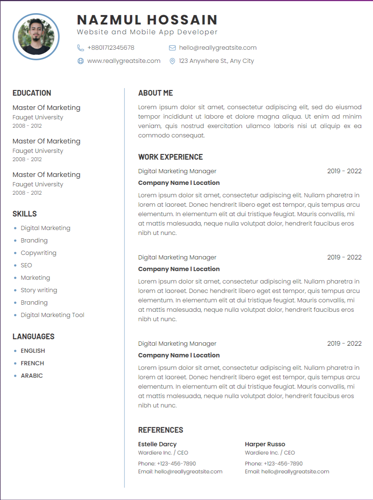

# Create a CV using HTML and CSS.

## Live Preview Link below
👉 <a href="https://nazmulhossain2905.github.io/html-and-css-resume-design/">Live Preview</a>

### Screenshot

 

### Using languages
* HTML
* CSS

##### You can follow me.
# Than You.
